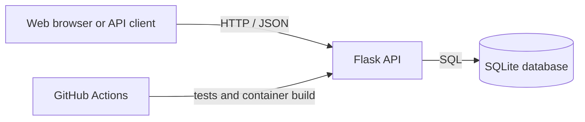

# Cloud Resume API

[](https://github.com/kianwilson32-dev/cloud-resume-api/actions/workflows/ci.yml)

A Flask REST API that will evolve into the backend for my cloud-hosted resume.

This project is deliberately built in small versions. The first version provides two JSON endpoints; later versions will add a database, automated tests, Docker, CI/CD, Azure deployment, infrastructure as code, and monitoring.

## Current features

- Python Flask API
- JSON responses
- `GET /` welcome endpoint
- `GET /about` professional-profile endpoint backed by SQLite
- `PUT /about` endpoint with JSON validation
- Automated tests with pytest
- Static analysis with Ruff
- Docker container support
- GitHub Actions continuous integration
- Dependency management with `requirements.txt`

## Architecture



## API endpoints

| Method | Endpoint | Description |
| --- | --- | --- |
| `GET` | `/` | Returns a welcome message. |
| `GET` | `/about` | Returns a short professional profile. |
| `PUT` | `/about` | Replaces the stored professional profile. |

## Run locally

1. Install [Python 3.11+](https://www.python.org/downloads/).
2. Open a terminal in this directory.
3. Create and activate a virtual environment:

   ```powershell
   py -m venv venv
   .\venv\Scripts\Activate.ps1
   ```

4. Install dependencies and start the API:

   ```powershell
   pip install -r requirements.txt
   python app.py
   ```

5. Visit `http://127.0.0.1:5000/` or `http://127.0.0.1:5000/about`.

## Example response

```json
{
  "message": "Welcome to my Cloud Resume API!"
}
```

## Database

On its first run, the API creates `database/database.db` and adds a profile record. SQLite is a lightweight database stored in one local file, making it a useful development step before moving to a managed Azure database.

The database file is intentionally excluded from Git so that local data is never committed. Its schema and setup logic are version-controlled in `database/repository.py`.

## Update the profile

Use PowerShell to update the profile with a JSON request:

```powershell
$profile = @{
    name = "Kian Wilson"
    course = "Computing"
    career_goal = "Cloud Engineer"
} | ConvertTo-Json

Invoke-RestMethod -Method Put -Uri "http://127.0.0.1:5000/about" -ContentType "application/json" -Body $profile
```

The API requires all three non-empty fields. Afterwards, use `GET /about` to see the updated data.

## Automated tests

The API uses `pytest` for automated tests. The tests use a temporary SQLite database, so they do not change your local profile.

```powershell
.\venv\Scripts\python.exe -m pip install -r requirements-dev.txt
.\venv\Scripts\python.exe -m pytest
```

Run the static checks with:

```powershell
.\venv\Scripts\python.exe -m ruff check .
```

## Run with Docker

After installing Docker Desktop, build and run the production-style container:

```powershell
docker build -t cloud-resume-api .
docker run --rm -p 5000:5000 cloud-resume-api
```

The API will then be available at `http://127.0.0.1:5000/`.

## Continuous integration

Every push and pull request checks code quality, runs the test suite, and builds the Docker image through GitHub Actions. This catches broken changes before deployment.

## Roadmap

- [x] Add SQLite persistence
- [ ] Add the remaining CRUD API endpoints
- [x] Add automated tests with pytest
- [x] Containerize with Docker
- [x] Add GitHub Actions CI
- [ ] Deploy to Azure App Service
- [ ] Move data to Azure SQL or Cosmos DB
- [ ] Provision infrastructure with Terraform or Bicep
- [ ] Add Azure monitoring and logging
